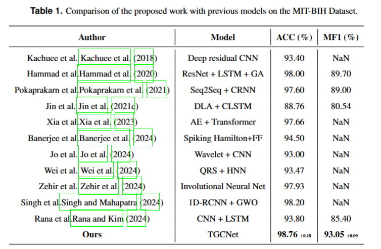
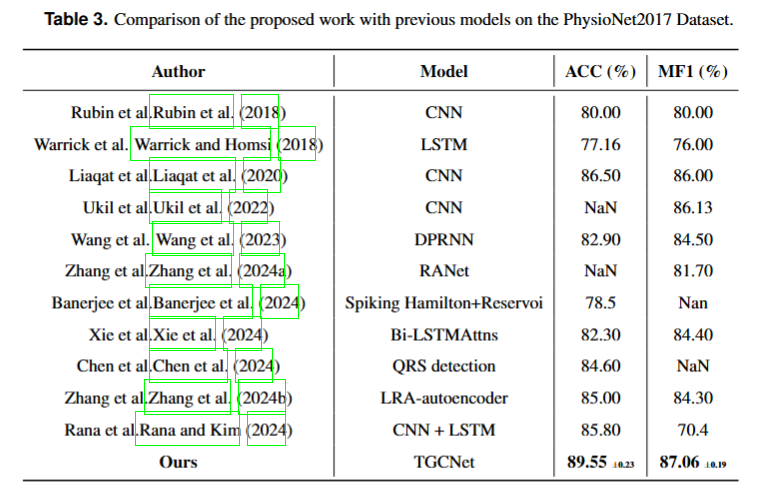

# TGCNet: Temporal Graph Compensation Network for Arrhythmia Classification 
#### *by: Nana Liu* ,wei Hu,Wenfeng Zhang

## About

Our proposed model, TGCNet, is a deep learning framework for ECG arrhythmia classification.


## Datasets
We used three public datasets in this study (Download our preprocessed version of the datasets from [zenodo](https://doi.org/10.5072/zenodo.213286)):
- [MIT-BIH](https://www.physionet.org/content/mitdb/1.0.0/)
- [PTB](https://physionet.org/content/ptbdb/1.0.0/)
- [Physionet2017](https://www.physionet.org/content/challenge-2017/1.0.0/)

## File Structure

- `configs/`: Contains configuration files.
  - `data_configs.py`: Configuration for data preprocessing.
  - `hparams.py`: Hyperparameter settings.
  
- `dataset/`: Directory to store datasets.
  - `mit/`, `ptb/`, `py2017/`: Subdirectories containing the respective datasets.
  
- `experiments_logs/`: Directory for saving the training results and model weights.
  - `all.png`, `result1.png`, `result2.png`: Visual results from the training.
  
- `dataloader.py`: Data loading and preprocessing.
- `main.py`: Main script to execute the training.
- `models.py`: Model architecture definitions.
- `README.md`: This README file.
- `t-SNE.py`: Code for t-SNE visualizations.
- `trainer.py`: Trainer class for managing the training process.
- `utils.py`: Utility functions.

## How to Use

1. **Prepare the Data**: Download and place the required datasets into the `dataset` folder under their corresponding subdirectories (`mit`, `ptb`, `py2017`).

2. **Set Up the Environment**: Ensure all necessary dependencies are installed as required by the project.

3. **Training the Model**:
   - Navigate to the root directory of the project.
   - Run the training by executing the following command:
     ```bash
     python main.py
     ```
   - The training process will automatically set the necessary data paths and store the resulting model weights in the `experiments_logs` folder.

## Results
<p align="center">

</p>
<p align="center">

</p>

## Python Environment
- **GPU**: NVIDIA GeForce GTX 3090 24G
- **PyTorch**: 2.2.1

- **NumPy**: 1.23.5

- **Pandas**: 2.2.3

- **Scikit-learn**: 1.6.1

- **SciPy**: 1.13.1
